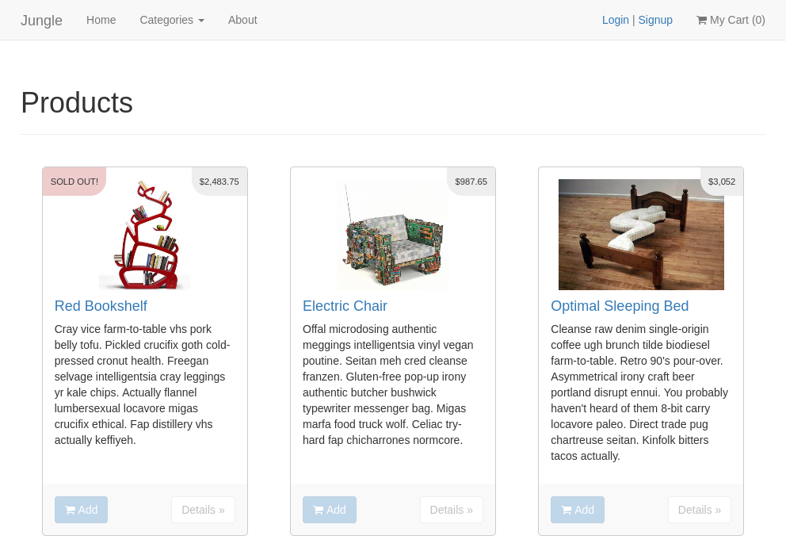
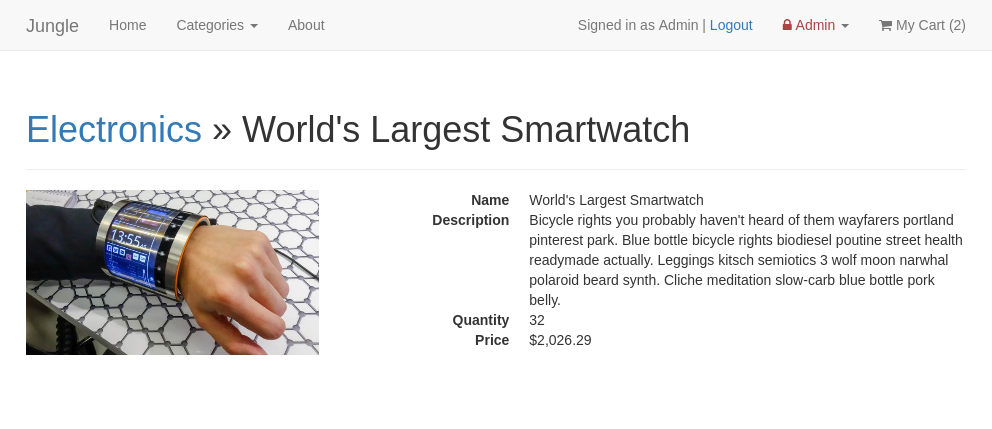
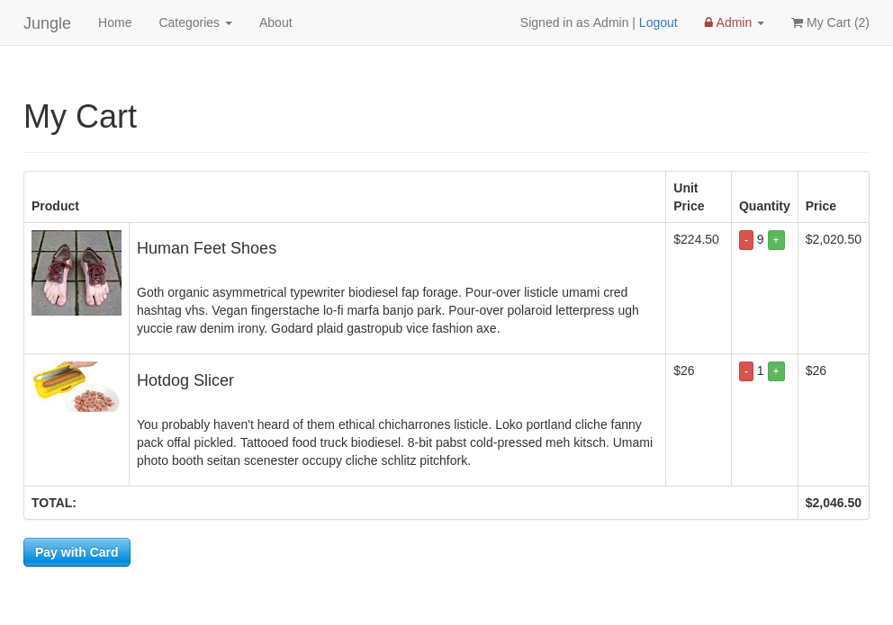
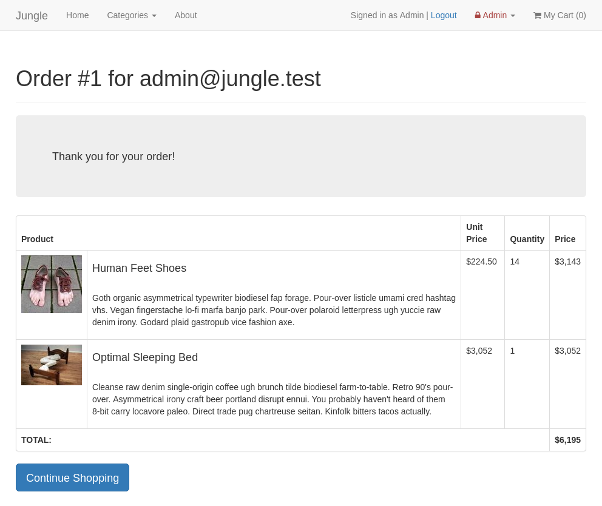

# Jungle

Jungle is a mini e-commerce application built with Rails 4.2 for purposes of teaching Rails by example.  This project simulated being dropped into an existing codebase with unfamiliar languages and frameworks and have us modify it with new features and bug fixes.  Automated testing using RSpec was also added.

Technologies used include [Ruby/Rails](https://rubyonrails.org/), [Postgres](https://postgresql.org), [Bootstrap](https://getbootstrap.com/), [RSpec](https://rspec.info/), and [Capybara](https://github.com/teamcapybara/capybara) for development and testing.

The app features and fixes I implemented on this project are as follows:

- Feature: Sold Out Badge - Add "SOLD OUT!" on listed products that are out of stock.
- Feature: Admin Categories - Allow administrators to add product categories.
- Feature: User Authentication - Add user signup and login.
- Enhancement: Order Details Page - Add order details to the order confirmation page.
- Bug: Missing Admin Security - Add authentication for administrators.
- Bug: Checking Out with Empty Cart - Show notice that cart is empty instead of an empty cart.
- Bug: Inconsistent Money Display - Dollar amounts updated to use humanized display across the app.

For development I added all the RSpec model and feature testing.

Jungle is not suitable for real-world production use and is only for demonstration and educational purposes.

## **Screenshots**

Jungle is pretty neato.

Home page displaying products:



Product details:



Cart loaded with shoes and a hotdog slicer:



Order details:



# Table of Contents

- [Development](#development)
  - [Directory Structure](#directory-structure)
  - [Dependencies](#dependencies)
  - [Development Dependencies](#development-dependencies)
  - [Support Setup](#support-setup)
  - [Database Setup](#database-setup)
  - [Jungle Setup](#jungle-setup)
  - [Running Jungle Server](#running-jungle-server)
- [Testing](#testing)
  - [Stripe Testing](#stripe-testing)
  - [Model Testing](#model-testing)
  - [Feature Testing](#feature-testing)
  - [Running Jest Test Framework](#running-jest-test-framework)
  - [Running Cypress Test Framework](#running-cypress-test-framework)

## **Development**

### **Directory Structure**

The project directory is arranged as follows:

```
./                  Main project repository
./app               Main application source directory
./app/assets        Static assets (JS, CSS, images, etc)
./app/controllers   MVC controllers
./app/helpers       Helper classes (currently not used)
./app/mailers       ActionMailer classes (currently not used)
./app/models        MVC models
./app/uploaders     CarrierWave uploader classes (currently not used)
./app/views         MVC ERB views
./config            Rails app configuration files
./db                Database files
./docs              Project documentation
./lib               Extended modules (currently not used)
./log               Log files for each environment
./public            Static files served to the client, including manifest.json
./spec              Testing specifications
./vendor            3rd party static assets (JS and CSS)

Do not edit or push to repo:

./bin               Rails executables
./tmp               Temporary files
```

### **Dependencies**

Jungle requires [Ruby/Rails 4.2](https://rubyonrails.org/) and [Postgres 9.x](https://www.postgresql.org/) and the following Ruby gems are used:

See `Gemfile` for gem dependencies.

### **Support Setup**

Install Ruby/Rails from your [package manager](https://nodejs.org/en/download/package-manager/), or [download](https://nodejs.org/en/download/) binaries (for fun) or source code (for maximum fun).

Install [Postgres](https://www.postgresql.org).

Sign up for a [Stripe](https://stripe.com) account for payment testing.

### **Database Setup**

Log into Postgres as a user with superuser privileges.  For example:

```sh
sudo -u postgres psql
```

Execute the following to create the development database:

```postgres
CREATE USER jungle_development WITH NOSUPERUSER PASSWORD 'development';
CREATE DATABASE jungle_devlopment OWNER jungle_development;
GRANT ALL ON DATABASE jungle_devlopment TO jungle_development;
```

### **Jungle Setup**

Execute the following to set up Jungle:

```sh
cd <project-directory>
git clone https://github.com/d0ugr/jungle
cd jungle
bundle install
```

Create `config/database.yml` by copying `config/database.example.yml`.

Create `config/secrets.yml` by copying `config/secrets.example.yml`.

These files can be used as is, or modify them to match database login credentials.

To create, load and seed the database, run:

```sh
bin/rake db:reset
```

Create `.env` by copying `.env.example` and modify the Stripe keys to match the ones from your account.  The admin login credentials can be changed or used as-is for testing if you like.

### **Running Jungle Server**

To start the server normally use:

```sh
bin/rails s
```

If running under a Vagrant virtual machine use:

```sh
bin/rails s -b 0.0.0.0
```

## **Testing**

### **Stripe Testing**

When making purchases using Jungle, use credit card number 4111 1111 1111 1111 for testing successful orders.

More information in their docs: <https://stripe.com/docs/testing#cards>

### **Model Testing**

To run all automated RSpec model tests ()

```sh
bin/rspec [--format documentation]
```

### **Feature Testing**

Feature tests are executed using Capybara and Poltergeist.  These tests are much slower than model tests so running only the one you might be working on is recommended:

```sh
bin/rspec spec/features/filename_spec.rb
```
